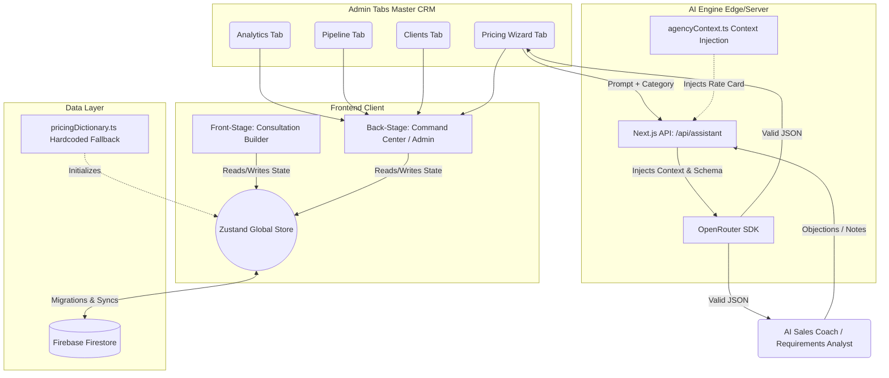

# 🚀 DevZilla Agency OS - System Architecture & Technical Documentation

This document serves as the complete technical blueprint, architecture mapping, and feature breakdown for the DevZilla Agency OS. It is designed to help developers, stakeholders, and agency staff fully understand the flow of data, AI integration, and modular components of the platform.

---

## 🛠️ 1. Core Technology Stack
- **Frontend Framework:** Next.js 14+ (App Router)
- **UI Library:** React.js
- **Styling:** Tailwind CSS (Glassmorphism, Dark/Teal/Blue neon themes)
- **State Management:** Zustand (`useAgencyStore.ts`)
- **Data Visualization:** Recharts (Area charts, Donut charts)
- **Database (Planned/Migrating):** Firebase Firestore
- **AI Infrastructure:** OpenRouter API
- **Primary AI Model:** `nvidia/nemotron-3-super-120b-a12b:free` (Chosen for high reasoning & strict JSON outputs)

---

## 🏗️ 2. System Architecture Diagram

---

## 🧩 3. Page & Tab Breakdown

### A. The Command Center (Admin Dashboard)
Location: `/admin`
The Master CRM is the brain of the agency. It contains the following modules:

1. **Analytics Tab**
   - **Purpose:** Revenue tracking and performance monitoring.
   - **Features:** 
     - KPI Cards: Total Value, Active Deals, Conversion Rate.
     - Revenue Trajectory Chart: Built with Recharts (`AreaChart`) showing monthly growth projections.
     - Industry Distribution Chart: Built with Recharts (`PieChart`) breaking down client types.
   - **Components:** `MasterCRM.tsx`

2. **Pipeline Tab (Pre-Consultation Tracker)**
   - **Purpose:** To manage raw leads before they become official clients.
   - **Features:**
     - **Quick Add:** Input phone, name, and category.
     - **Duplicate Protection:** Prevents adding a number that is already marked as "Not Interested".
     - **Status Pipeline:** Dropdowns to move leads through stages (`Lead` → `Follow Up` → `Meeting` → `Negotiating`).
     - **Quiet Convert:** One-click conversion sends the lead to the main "Clients" tab and shows a Toast notification to start a consultation.

3. **Clients Tab (Formal CRM)**
   - **Purpose:** Tracking active consultations and deals.
   - **Features:**
     - Displays selected packages and add-ons.
     - Magic Link Generator to copy the unique `/c/[clientId]` URL.
     - Deal Status tracking (`Won`, `Lost`, `Negotiating`).
     - "Open Shadow Editor" to edit client metadata.

4. **AI Pricing Wizard Tab**
   - **Purpose:** A dynamic tool to create database-ready pricing structures using natural language.
   - **Features:**
     - Category Selector (with the ability to dynamically add new custom categories like "Saloon").
     - **Hybrid Approval Gate:** AI parses Hindi/English prompts into JSON, but instead of saving blindly, it populates an editable form. The Admin can manually override prices or deduction values before clicking `[ Approve & Live Update ]`.

5. **AI Assistant Sidebar**
   - **Purpose:** Context-aware sales intelligence.
   - **Features:**
     - **Analyze Requirements:** Pasting a client's raw notes allows the AI to recommend a base package, addons, and a Vibe Coding timeline based strictly on `agencyContext.ts`.
     - **Sales Coach:** Input a client objection (e.g., "Wix is cheaper") and the AI generates 3 highly persuasive rebuttals to close the deal.

### B. The Consultation Front-Stage
Location: `/c/[clientId]`
- **Purpose:** The live, interactive proposal sent to the client.
- **Features:**
   - Real-time pricing calculator.
   - Modular Add-on selection.
   - Infrastructure toggles (DevZilla Hosting vs Client Hosting).
   - "Competitor Matrix" to visually prove DevZilla's superiority over templates.
   - Payment milestone selector (100% upfront vs 50/50).

---

## 🤖 4. AI & Data Intelligence Flow

### Context Injection (The Secret Sauce)
DevZilla's AI is heavily restricted so it never hallucinates fake prices.
1. When the Admin asks a question, the API (`/api/assistant/route.ts`) intercepts it.
2. It imports `src/config/agencyContext.ts`, which contains the exact DevZilla Rate Card (Basic: ₹12,999, etc.).
3. It appends this Rate Card to the System Prompt.
4. The AI processes the user's request *only* within the boundaries of that Rate Card.

### The Auto-Retry Loop (Fail-Safe)
Because Free Tier AI models sometimes output markdown or invalid JSON, the frontend (`AIAssistant.tsx`) wraps the API call in a `try/catch` block.
- If the AI fails to return valid JSON, the system intercepts the crash.
- It shows the user: `"AI format error. Re-analyzing... (Attempt 2/3)"`.
- It automatically re-prompts the AI up to 3 times to guarantee a stable response without crashing the application.

---

## 🗂️ 5. Key File & Component Directory

| File Path | Description |
|-----------|-------------|
| `src/store/useAgencyStore.ts` | The Global Brain. Uses Zustand. Holds `clients`, `leads`, pricing logic, and functions to calculate the `finalPrice`. |
| `src/config/pricingDictionary.ts` | The hardcoded data structure holding the schemas for `BasePackages` and `ModularAddons`. |
| `src/config/agencyContext.ts` | The text-based rulebook fed to the AI so it understands DevZilla's services and pricing. |
| `src/components/os/BackStage/MasterCRM.tsx` | The massive Admin Dashboard component containing Analytics, Pipeline, Clients, and the AI Pricing Wizard. |
| `src/components/os/BackStage/AIAssistant.tsx` | The right-hand sidebar for Sales Coaching and Requirement Analysis. |
| `src/lib/openrouter.ts` | The wrapper that connects Next.js to OpenRouter. Holds the precise few-shot prompts to enforce JSON formatting. |
| `src/app/api/assistant/route.ts` | The secure backend Next.js API that hides the OpenRouter API Key and routes requests (`sales_coach`, `pricing_wizard`). |

---

## 🔄 6. Future Data Migration (Firestore)
Currently, data is heavily reliant on `useAgencyStore` (which resets on refresh) and `pricingDictionary.ts` (which is hardcoded). 
A migration route `src/app/api/migrate-pricing/route.ts` was built to dump the dictionary into Firebase. Once Firebase security rules are configured, the AI Pricing Wizard's "Approve & Live Update" button will dynamically write to the `settings/pricing` collection in Firestore, making the entire OS permanently persistent.
